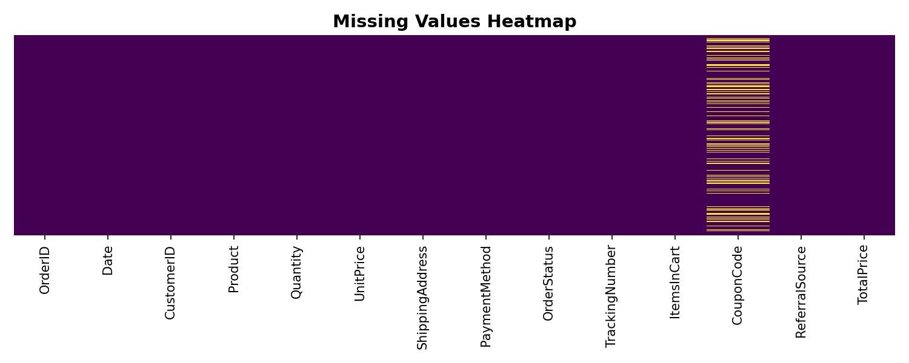
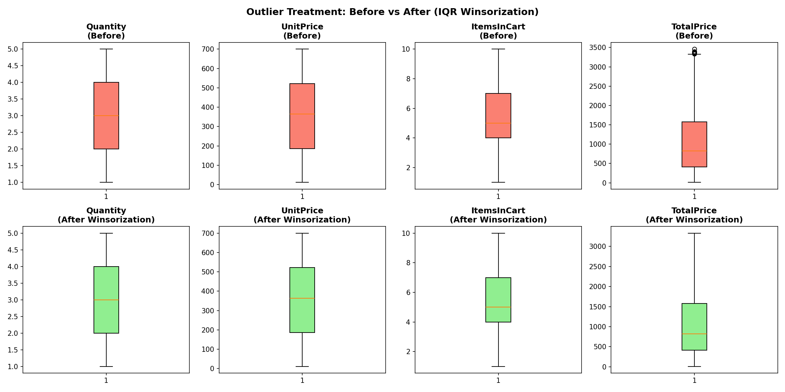
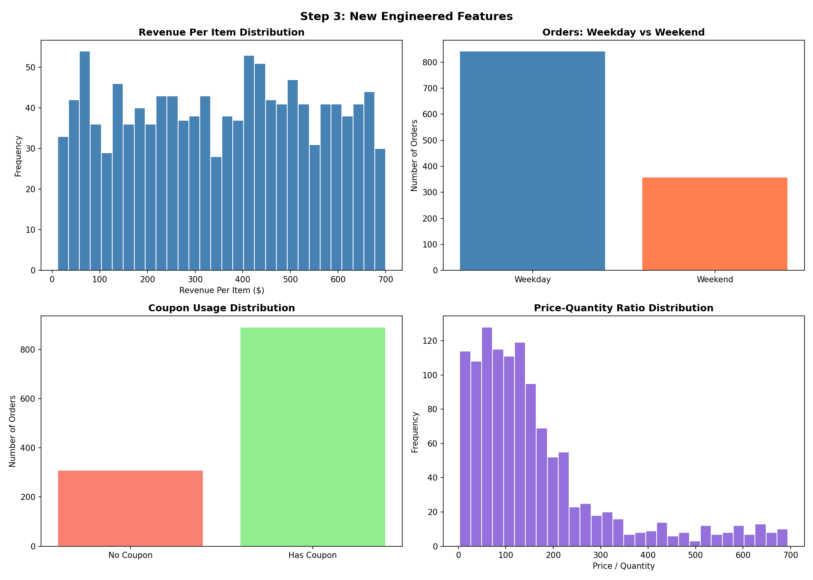
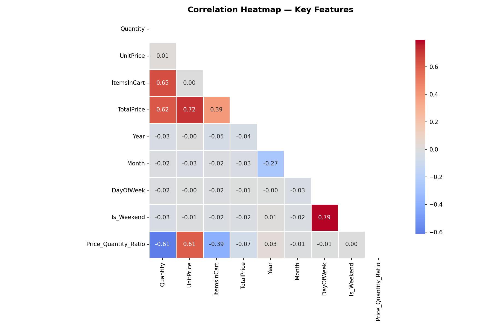
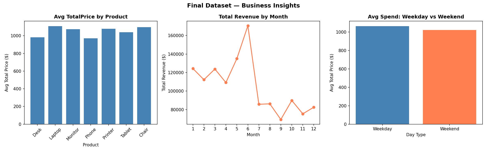

# 🔬 Data Science Project 1 — Advanced EDA & Feature Engineering
### DecodeLabs Industrial Training Kit | Batch 2026

---

## 📌 Project Overview
This project is part of the **DecodeLabs Data Science Internship 2026**.  
The goal is to master **Advanced EDA & Feature Engineering** by transforming 
raw, chaotic data into a clean, production-ready dataset using enterprise-grade techniques.

---

## 🎯 Objectives
- Handle missing values using statistical imputation (Mean/Median/KNN)
- Detect and neutralize outliers using IQR (Winsorization)
- Engineer at least 3 new predictive features
- Validate data quality using Pandera schemas
- Build a vectorized, production-ready pipeline

---

## 🛠️ Tech Stack
| Tool | Purpose |
|------|---------|
| Python 3.10 | Core language |
| Pandas | Data manipulation |
| NumPy | Vectorized operations |
| Scikit-learn | KNN Imputation |
| Pandera | Data validation contracts |
| Matplotlib/Seaborn | Visualizations |
| Jupyter Notebook | Development environment |

---

## 📁 Project Structure
project1/

├── data/

│   ├── raw/          # Original dataset (untouched)

│   └── clean/        # Cleaned & validated dataset

├── notebooks/

│   └── project1_eda.ipynb   # Main notebook

├── screenshots/      # Visualizations & outputs

├── outputs/          # Final CSV & Parquet files

└── README.md

---

## 🔄 Pipeline Architecture (IPO Model)

### MODULE 1 — INPUT (Securing Fidelity)
- Calculate missingness % per feature
- Apply decision matrix: Drop / Median / KNN
- Cap outliers using IQR boundaries (Winsorization)

### MODULE 2 — PROCESS (Vectorized Engine)
- One-Hot Encoding for categorical variables
- Collinearity eradication (threshold: 0.80)
- Engineer 3+ new predictive features

### MODULE 3 — OUTPUT (Contracts & Serving)
- Pandera schema validation
- Export to CSV + Parquet
- Feature store ready

---

## 📸 Screenshots

### Missing Values Heatmap

### Outliers Before vs After

### Engineered Features

### Correlation Heatmap

### Final Business Insights

---

## 👩‍💻 Author
**Imen Hammami**  
Data Science Intern @ DecodeLabs 2026  
🔗 [Portfolio](imenhammami.netlify.app)  
🔗 [LinkedIn](linkedin.com/in/hammamiimen)
